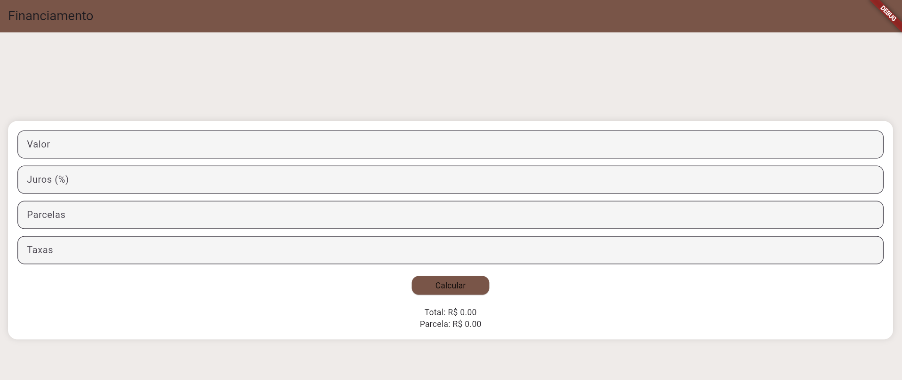
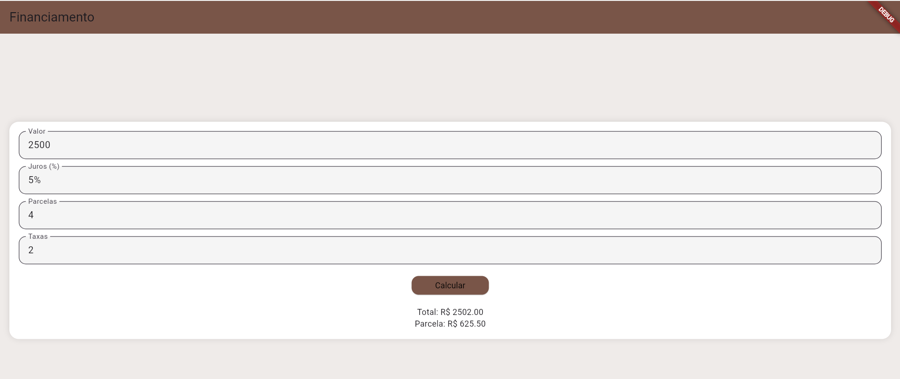

#Simulador de Financiamento

##Descrição
Aplicativo desenvolvido em Flutter para simular financiamentos. O usuário informa o valor do bem, taxa de juros, número de parcelas e taxas adicionais, e o app calcula o valor total a ser pago e o valor de cada parcela.

##Funcionalidades
- Entrada de valor do financiamento
- Entrada de taxa de juros mensal
- Entrada de número de parcelas
- Entrada de taxas adicionais
- Cálculo automático do valor total
- Exibição do valor das parcelas

##Fórmula utilizada
Montante = Valor × (1 + juros × parcelas) + taxas  
Parcela = Montante ÷ parcelas

##Tecnologias
- Flutter
- Dart

##Como executar
1. Clone o repositório:
   git clone https://github.com/CorreaLeticia/Flutter-Financiamento.git

2. Abra no VSCode ou Android Studio

3. Execute os comandos:
   flutter pub get  
   flutter run

##Prints do App

Tela inicial

Resultado
